# Spec Contracts

[](https://github.com/balaji-balu/spec-contracts/actions/workflows/ci.yml)
[](LICENSE)
[](https://balaji-balu.github.io/spec-contracts/)
[](https://balaji-balu.github.io/spec-contracts/docs/roadmap.html)

**An AI-native, spec-driven development platform. The spec is the source of truth: agents generate code from it and feed changes back into it (spec ⇄ code), with every step validated, evaluated and human-approved.**

**[Website](https://balaji-balu.github.io/spec-contracts/)** · [Roadmap](https://balaji-balu.github.io/spec-contracts/docs/roadmap.html) · [Walkthrough](https://balaji-balu.github.io/spec-contracts/docs/scenario/spec-pipeline-walkthrough.html) · [Architecture](docs/architecture.md) · [Contributing](CONTRIBUTING.md)

<p align="center"></p>

## Why

AI agents write code fast and still build the wrong thing. Specs go stale, code drifts from what the business meant, and nobody can say which is right. Spec Contracts keeps one agreed spec and keeps code and spec in step, in both directions:

- **Spec-to-code.** Agents turn intent into requirements, design, then code and tests, one small reviewable step at a time.
- **Code-to-spec.** A failing test, a design misfit, an incident or a hand edit comes back as a proposed spec change, through the same gates.
- **Checked, not trusted.** A deterministic linter runs before any LLM judge, eval suites measure every prompt or model change, and a person approves every step in a pull request.
- **Not waterfall.** The first spec is a hypothesis and design is discovered while building ([Fowler and Joshi](https://martinfowler.com/articles/convo-llm-abstractions.html)), so the spec grows in small PRs and changes whenever the code or the business teaches something new.

> **Status:** early. Milestone M1, one real agent (requirements analysis), is nearly done. The code side of the loop is planned, not built. Interfaces will change.

## See it

One agent step, replayed from `npm run demo` (a scripted model, so no key and no cost). The agent is blocked from editing a file it doesn't own, fails lint on a missing field, repairs it, and routes its finding to a human:

<p align="center"></p>

Specs are Markdown people can read, made of strict blocks a parser can check. A requirement from the [worked example](examples/specs/SPEC-0001/requirements.md) (long lines wrapped):

```markdown
### REQ-002 · Refund the full payment
- type: functional
- context: Payments
- priority: must
- statement: When the Payments context receives an order-cancelled notice for an Order Reference,
  the Payments context shall issue a Refund of the full captured Payment.
- acceptance:
  - AC-002.1: Given a captured Payment for an Order Reference When an order-cancelled notice arrives
    Then a Refund for the full Payment amount is issued
  - AC-002.2: Given a Refund already issued for an Order Reference When a duplicate order-cancelled
    notice arrives Then no second Refund is issued
- terms: [Order Reference, Refund, Payment]
```

Its terms are checked against the glossary, and `trace.yaml` links it to the goals it derives from and the design that realizes it.

## Quickstart

You need Node 20 or later and git. The first three steps need no model key, no Docker and no spend.

```
git clone https://github.com/balaji-balu/spec-contracts.git
cd spec-contracts
npm install

npm run demo -w step-runner -- --verbose   # watch one agent step end to end with a scripted model
npx spec-lint examples examples/specs/SPEC-0001 --kb evals/cases/golden/G-0001-refund/inputs/kb   # lint the worked example
npm test --workspaces                      # linter, pi tools, step runner and scorer tests (pi's faux model, no key)
```

A **real** agent run needs a model key and the litellm gateway (Docker). It costs about $1 and takes about 3 minutes:

```
cp gateway/litellm/.env.example gateway/litellm/.env      # then add your keys to .env
docker compose -f gateway/litellm/docker-compose.yml up -d
npx run-step evals/cases/seeded/SD-RA-0001-refund --verbose
```

## How it works

<details>
<summary><b>Principles</b>: the seven rules the platform is built on</summary>

1. **The spec is a living hypothesis.** It grows in small PRs (intent, analysis, requirements, design) and changes when implementation or the business proves it wrong. Every change is a diff that is linted, traced and approved, and the code follows it. Nothing is specified up front for its own sake.
2. **The workflow owns control flow; agents own judgment inside one step.** No agent picks the next step.
3. **Git is the state.** An artifact's header `status` plus its branch/PR is the entire workflow state. The reconciler is stateless.
4. **Markdown with strict blocks.** Humans read it, the parser validates it. Unknown keys fail validation.
5. **`trace.yaml` is the only link layer.** Artifacts never reference other artifacts' IDs in their body.
   Domain *vocabulary* (`context:`, `terms:`) is not a trace link. It is checked against the domain model.
6. **Constitution owns org-wide rules, glossary owns language, CML owns boundaries.** Glossary and CML are shared across specs under `domain/`; the constitution lives in the org KB and is pinned by version.
7. **Every artifact pins what it was built from** (`upstream`) **and who built it** (`produced_by`). Staleness and agent drift are detectable mechanically.

</details>

<details>
<summary><b>Pipeline</b>: phases, agent steps and human gates</summary>

| Phase | Agent step(s) | Writes | Human gate |
|---|---|---|---|
| 1 Intent | `intent` (conversational with the user) → `ddd-seed` | `intent.md`, proposed glossary terms | BA approves intent PR |
| 2 Requirements | `req-analysis` ⇄ `ddd-strategic` / human → `req-generation` | `requirements-analysis.md`, `requirements.md`, `strategic.cml`, `glossary.md`, `trace.yaml` | BA approves (+ architect if `domain/` changed) |
| 3 Design | `design-analysis` ⇄ `ddd-tactical` / architect → `design-generation` | `design-analysis.md`, `design.md`, `contexts/*.cml`, `trace.yaml` | Architect approves |
| 4 Handoff | none (reconciler only) | tag `SPEC-0042/v<n>-ready` | none |

Between every agent step and its human gate: **validate** (deterministic, `contracts/validation-rules.md`)
then **eval gate** (rubric/judge; thresholds in `evals/thresholds.yaml`).

The [contracts](contracts/) define it all: `header.schema.json` (the frontmatter every artifact carries), `block-grammar.md` (the strict-block format and ID scheme), `validation-rules.md` (every lint rule and the metrics it emits) and `workflow.md` (the reconciler: states, branches, PRs, loops, back-edges, eval mode). The detailed diagram is in [docs/architecture.md](docs/architecture.md); design decisions are logged in [docs/decisions.md](docs/decisions.md), with ADRs in [docs/adr/](docs/adr/).

</details>

<details>
<summary><b>Repository layout</b>: this repo, and what a spec project looks like</summary>

**This repo**

```
contracts/                       # source of truth: header schema, block grammar, validation rules, workflow
templates/                       # what agents fill in: spec/ (one file per artifact) and domain/ (glossary, CML)
examples/                        # the worked SPEC-0001 with its domain and a sample org constitution (lint fixture, eval reference)

AGENTS.md                        # behaviour rules every pi session loads (pinned by hash)
agents/<step>/                   # the step's prompt.md (task + mode preambles) and AGENTS.md
skills/<name>/SKILL.md           # pi skills the steps load
pipeline.lock.yaml               # what each step runs with: model, prompt, skills, extensions, template and AGENTS.md hashes

packages/spec-lint/              # the linter (TypeScript): CLI + library
packages/pi-spec-tools/          # the tools agents call: validate_artifact, trace_link, term_lookup, kb_search, kb_get
packages/step-runner/            # run-step: one agent step on an eval case (stands in for the reconciler in M1)
packages/eval-runner/            # score and run-suite: score runs, run a case k times, write the report
gateway/litellm/                 # the litellm gateway every model call goes through (docker compose, config, .env.example)
evals/                           # eval harness: cases, rubrics, judge prompt, thresholds, scoring rules
tools/spec-lint-prototype.py     # throwaway Python prototype, kept until parity is reviewed

docs/architecture.md             # the detailed architecture diagram and what each part does
docs/decisions.md                # decisions log: D1, D2, …, each proposed or decided
docs/adr/                        # architecture decision records: the full write-up of the bigger decisions
docs/platform/features.md        # platform features register: governance and observability, by ID, stage and status
docs/scenario-SPEC-0001.md       # end-to-end walkthrough of one spec (as a page: docs/scenario/spec-pipeline-walkthrough.html)
docs/milestones/                 # milestone kickoff notes
docs/diagrams/                   # diagram sources, the overview and the demo replay
docs/roadmap.html                # the roadmap: milestones and the decisions they need
index.html                       # the website home page (GitHub Pages); every page shares its top navigation

runs/                            # run outputs, gitignored: spec files, session JSONL, lint.json, run.json
```

The HTML pages are published with GitHub Pages, since GitHub shows `.html` files as source.

**A spec project**, what the platform creates in a product team's repo (`examples/` holds a small one):

```
domain/                          # shared across all specs, architect-owned (CODEOWNERS)
  glossary.md                    # ubiquitous language (terms, per bounded context)
  strategic.cml                  # subdomains + context map; imports every context file
  contexts/<Context>.cml         # one BoundedContext each: header layer (requirements phase)
                                 #   + aggregates/entities/events (design phase)
specs/
  SPEC-0042-<slug>/
    intent.md                    # phase 1
    requirements-analysis.md     # phase 2a (findings)
    requirements.md              # phase 2b
    design-analysis.md           # phase 3a (findings)
    design.md                    # phase 3b
    trace.yaml                   # all cross-artifact links
```

</details>

## Contributing

The project is looking for builders. Good places to start: eval cases from real specs that went wrong, lint rules, small agent tools, the governance and observability features in the [features register](docs/platform/features.md), and the code side of the loop. [CONTRIBUTING.md](CONTRIBUTING.md) explains how, and issues labelled `good first issue` are a good first step. Questions and ideas are welcome in [Discussions](https://github.com/balaji-balu/spec-contracts/discussions).

If the idea is useful to you, a star helps others find it. To report a vulnerability, see [SECURITY.md](SECURITY.md); everyone taking part follows the [code of conduct](CODE_OF_CONDUCT.md).

Released under the [MIT licence](LICENSE).
