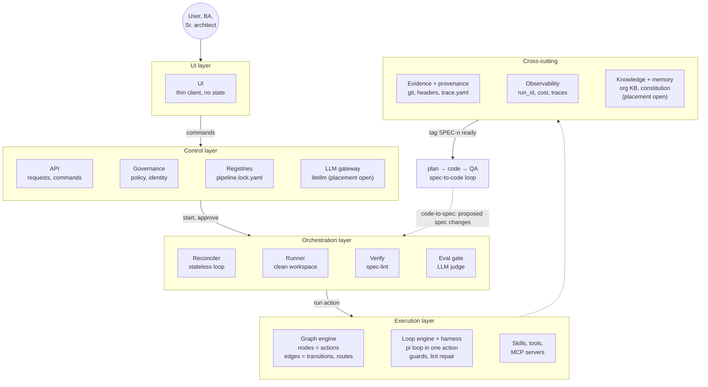
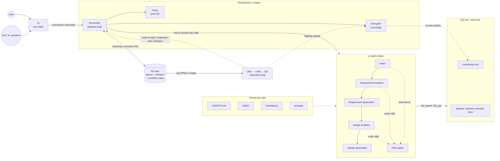

# Architecture

The detailed view of the platform. For the one-screen overview, see the [README](../README.md).

## Layers

The target architecture has four layers and a set of cross-cutting concerns (decision D23, proposed). The shape is being settled in [Discussion #21](https://github.com/balaji-balu/spec-contracts/discussions/21); boxes marked "placement open" are still being decided there.

Source: [diagrams/00-layers.mmd](diagrams/00-layers.mmd); edit that file and copy it here. Component IDs are in the [features register](platform/features.md#architecture-map).

| Layer | What it holds | In this repo today |
| --- | --- | --- |
| **UI** | Thin client for users, the BA and the architect. Talks only to the control plane; holds no workflow state. | Not yet: PR comments and a chat CLI come first (M3) |
| **Control** | Governance (policy, permissions, identity), registries (agents, skills, models, projects) and the API. | `pipeline.lock.yaml` is the registry for now |
| **Orchestration** | The reconciler, the runner that gives each action a clean workspace, and the gates it calls: verify, then eval. | `packages/step-runner` stands in for the reconciler (M1); `spec-lint`; the judge |
| **Execution** | **Graph engine:** the workflow as a graph, with actions as nodes and transitions and routes as edges. **Loop engine and harness:** the pi agent loop inside one action, with guards, lint repair and pinned `AGENTS.md`. **Skills, tools and MCP servers:** what an agent can call. | Step order and routes in `contracts/workflow.md`; pi plus the step-runner guard; `packages/pi-spec-tools`, `skills/` |
| **Cross-cutting** | **Evidence and provenance:** git, artifact headers, `trace.yaml`, PRs and tags. **Observability:** `run_id` on every call, cost, traces. **Knowledge and memory:** the org KB and constitution, later a knowledge graph. | Headers and `trace.yaml`; `run.json` and litellm tags; the file-based KB (D18) |

Open in #21:

1. **Knowledge and memory: cross-cutting or execution?** One option is to split them: the store is cross-cutting, agents reach it through execution tools, and the control plane enforces the scopes (GOV-11).
2. **Graph engine vs reconciler.** Either the graph is a versioned definition that the reconciler walks, or the graph engine drives execution and orchestration only schedules and runs. This is due before the reconciler is built in M3.
3. **The litellm gateway:** a control-plane shared service, or execution infrastructure.

## How a spec flows

Source: [diagrams/00-architecture.mmd](diagrams/00-architecture.mmd); edit that file and copy it here. Steps other than requirement analysis, the execution loop and the code-to-spec path are still planned.

## The parts

- **UI (thin client).** Where the user states intent and the BA and senior architect review. It sends commands to the reconciler and holds no workflow state.
- **Reconciler.** A stateless loop that reads the git repo, decides the next step and starts one pi session for it. Git (branches, commits, PRs, artifact header `status`) is the whole workflow state; see [contracts/workflow.md](../contracts/workflow.md).
- **Verify (spec-lint).** The deterministic linter. It always runs before the eval gate; rules are in [contracts/validation-rules.md](../contracts/validation-rules.md).
- **Eval gate (LLM judge).** Scores each artifact against rubrics and the constitution; see [evals/](../evals/README.md). The judge model always differs from the generator.
- **pi agent steps.** One pi session per step: intent, requirement analysis, requirement generation, design analysis, design generation, with a DDD agent for domain questions. What each step runs with (AGENTS.md, skills, templates, prompts) is pinned in [pipeline.lock.yaml](../pipeline.lock.yaml).
- **Org KB (read only).** The constitution, policies, system and provider docs, read through `kb_search` and `kb_get`.
- **Execution loop: spec-to-code.** Plan → code → QA, started when a spec is tagged ready. It consumes only the approved spec.
- **Code-to-spec.** What the execution loop learns (failing tests, design misfits, incidents, hand edits) comes back to the reconciler as a proposed spec change, which goes through the same verify, eval and approval gates. Lagging signals also feed the eval gate.

Every model call goes through the litellm gateway ([ADR 0001](adr/0001-llm-routing.md)). Governance and observability features are tracked in the [platform features register](platform/features.md).

## Step-by-step diagrams

Sequence diagrams for each phase; the [SPEC-0001 scenario walkthrough](scenario-SPEC-0001.md) shows them in context:

- [01-intent.mmd](diagrams/01-intent.mmd): the user states intent
- [02-requirements.mmd](diagrams/02-requirements.mmd): requirements analysis and generation, with the BA
- [03-design.mmd](diagrams/03-design.mmd): design analysis and generation, with the architect
- [04-verify-handoff.mmd](diagrams/04-verify-handoff.mmd): verify, eval and handoff to execution
- [05-full-scenario.mmd](diagrams/05-full-scenario.mmd): the whole flow end to end
