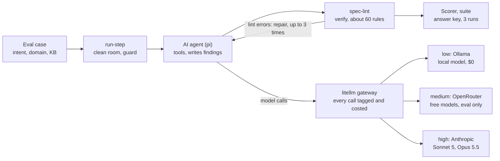

# Spec pipeline: project review

26 Sep 2026 · Balaji B · Exported from the [Claude Doc](https://claude.ai/code/artifact/d150e9c5-660d-4ea5-a0d8-bfd82cfc4b95), which is the copy reviewers comment on; re-export after changes.

## Summary

M1, the first real AI agent, is 6 of 7 steps done and on schedule against the roadmap's 2–3 week estimate. One real agent run on a test case caught all 5 planted defects for $0.88; a later run missed one blocker, which is why release is judged on the worst of 3 runs.

|  |  |
| --- | --- |
| Milestone | M1 "One real agent" (of M0–M6); M0 done |
| Built | Linter, agent tools, the req-analysis agent, cost gateway, scorer and 3-run suite runner; 7 PRs merged |
| Spend so far | About $1.10 on real model runs |
| Next | Smoke-test the three cost tiers, then the 3-run release suite (about $3–6) |
| Asks | One seeded case from the BA; a judge model choice; BA and architect labelling time for M2 |

## What the project is

AI agents turn a business request into approved requirements and designs, with the BA and architect approving each phase through pull requests. Only approved, tagged specs feed the later plan → code → QA loop.

The agents are held to written contracts, so their output can be checked by machine before a person reads it:

- **A strict document format.** Every artifact is Markdown with fixed sections and ID-numbered blocks.
- **A deterministic linter** checks structure, links and wording against about 60 rules.
- **An eval harness** scores the agent on test cases with planted defects and an answer key, three runs at a time because AI output varies.
- **Traceability.** Every finding links to the goal or constraint it concerns, so later steps can trace a requirement back to its source.

The riskiest step, requirements analysis, was built first because it is the cheapest to measure: seeded recall needs no human grader.

## Architecture

Today one agent step runs end to end on test cases; the reconciler that chains all five steps through git and PRs comes in M3.

The agent works in a locked, clean workspace and may write only its own output file. The linter checks its work and sends errors back for up to 3 repairs; the scorer then grades it against the case's answer key.

| Piece | Role | Code |
| --- | --- | --- |
| Contracts | Document format, about 60 lint rules, the workflow; everything else obeys them | `contracts/` |
| spec-lint | Deterministic checker, also a tool the agent calls on its own work | `packages/spec-lint` |
| Agent tools | Validate, link findings to goals, look up glossary terms, search the company KB | `packages/pi-spec-tools` |
| run-step | Builds the clean workspace, loads rules and prompt, guards writes, runs the repair loop | `packages/step-runner` |
| Scorer, run-suite | Grades a run against the answer key; runs a case 3 times and reports worst and mean | `packages/eval-runner` |
| litellm gateway | Every model call goes through it, tagged by step, run and case, with its cost | `gateway/litellm` |
| pipeline.lock.yaml | Pins model tiers, prompt, skill and tool versions so runs are reproducible | repo root |

## Status against the roadmap

M0 is done and M1 is nearly done; M2 (the judge) should run alongside M1 but has not started. The roadmap puts the whole path at about 5–6 months.

| Milestone | What it proves | Size (roadmap) | Status |
| --- | --- | --- | --- |
| M0 Contracts and eval harness | Specs can be checked by machine | done | Done |
| M1 One real agent | An agent does real requirements analysis, and we can measure it | 2–3 weeks | 6 of 7 steps done |
| M2 A judge you can trust | AI judge scores agree with the BA and architect | 1–2 weeks + labelling | Not started |
| M3 Requirements phase end to end | The reconciler carries a spec to approved requirements through PRs | 4–6 weeks | Planned |
| M4 Design phase | Designs an architect approves; problems can go back to requirements | 3–4 weeks | Planned |
| M5 Pilot with one team | It helps on real work, within budget | 4–6 weeks | Planned |
| M6 Execution handoff | Good specs lead to less rework | 6–8 weeks | Planned |

**M1 steps**

| Step | Delivered | PR |
| --- | --- | --- |
| 1 | spec-lint in TypeScript, matching the Python prototype on every fixture | [#1](https://github.com/balaji-balu/spec-contracts/pull/1) |
| 2 | `validate_artifact` tool for the agent | [#2](https://github.com/balaji-balu/spec-contracts/pull/2) |
| 3 | `trace_link`, `term_lookup`, `kb_search` / `kb_get` tools | [#3](https://github.com/balaji-balu/spec-contracts/pull/3) |
| 4 | req-analysis prompt, skill, rules, `pipeline.lock.yaml`, `run-step` | [#4](https://github.com/balaji-balu/spec-contracts/pull/4) |
| 5 | litellm gateway in front of every model call | [#5](https://github.com/balaji-balu/spec-contracts/pull/5) |
| 6 | TypeScript scorer and 3-run suite runner | [#6](https://github.com/balaji-balu/spec-contracts/pull/6) |
| 7 | Real 3-run suite on the test case, baseline committed | Next |

Also merged: the routing ADR ([#7](https://github.com/balaji-balu/spec-contracts/pull/7)). In progress on a branch: low, medium and high cost tiers, tested, awaiting smoke runs before its PR.

## Evidence

Two real runs on the seeded test case SD-RA-0001 (a refund request with 5 planted defects) show the agent can catch every defect, and that one run is not enough to trust it.

| Run (25 Sep 2026) | Model | Blocker recall | Recall, all | Severity right | Route right | Noise | Cost | Time | Result |
| --- | --- | --- | --- | --- | --- | --- | --- | --- | --- |
| First | openai/gpt-5.5 | 1.0 | 0.9 | 1.0 | 1.0 | 0.29 | $0.88 | 182 s | Pass |
| Second | openai/gpt-5.6-terra | 0.5 | 0.9 | 0.8 | 1.0 | 0.44 | $0.23 | 259 s | Fail: one blocker rated too low |

Release thresholds: blocker recall 1.0 on the worst of 3 runs; recall 0.85, severity and route 0.8, noise at most 0.35 on the mean. Both runs finished with 0 lint errors and no blocked writes. Neither used the new high tier; step 7 will be the first runs on Claude.

**Quality of the tooling**

- The TypeScript linter matches the Python prototype on every fixture: the worked example and judge fixtures are clean, and every planted defect is caught.
- The scorer reproduces both expected score reports byte for byte, and agrees with the prototype on the two real runs.
- CI runs 5 jobs (linter, tools, runner, eval runner, prototype parity) on every PR; all green on PRs #5–#7.
- Tests need no model key and no spend: they drive real agent sessions with a scripted model and a fake gateway.
- The low tier works through the gateway (a correct tool call from the local model), at about 10 tokens a second on the laptop.

## Decisions

The core architecture is settled; the open choices are models, the judge and M3's git workflow. Decisions D6–D13 in the repo README are still proposed and settle in the M5 pilot.

**Made**

| Decision | Choice | Record |
| --- | --- | --- |
| Agent harness | pi, one session per agent step, everything pinned in `pipeline.lock.yaml` | CLAUDE.md |
| Orchestration | Git as state, a stateless reconciler, one branch and PR per spec per phase; merge means approval | workflow.md |
| Artifact format | Markdown with strict ID blocks, checked by a parser; `trace.yaml` is the only link layer | block-grammar.md |
| Domain model | ContextMapper CML for boundaries, glossary for language, constitution for org rules | CLAUDE.md |
| Verify before eval | Deterministic lint always runs before the AI judge; the judge's model differs from the generator's | CLAUDE.md (README D12, proposed) |
| Model routing | Every call through a local litellm gateway, tagged and costed | D20, [ADR 0001](adr/0001-llm-routing.md) |
| Cost tiers | low: local Ollama; medium: OpenRouter free models, eval cases only; high: Claude Sonnet 5 and Opus 5.5 | D22 (on branch) |
| KB location | Plain files first, a knowledge graph later behind the same search tool | Roadmap |

**Due**

| Decision | Due | Current lean |
| --- | --- | --- |
| Generator model for req-analysis | M1 step 7 | Sonnet 5 vs Opus 5.5, picked by the worst of 3 runs |
| Judge model | M2 | Outside the generator's model family, picked by agreement with humans |
| PR granularity (D7) | M3 | One PR per phase |
| Stale pins: block or warn (H4) | M3 | Warn in M3, block from the pilot |
| Who hosts the shared gateway | M3 | Open |

## Risks and open issues

The biggest risk to the schedule is people's time for M2 labelling, not the build; the biggest risk to quality is that one run can miss a blocker.

| Risk | Evidence or early signal | Response |
| --- | --- | --- |
| One run misses a blocker | The gpt-5.6-terra run rated a blocker too low | Release judged on the worst of 3 runs; step 7 compares Sonnet 5 and Opus 5.5 |
| Only one seeded case | All scores come from SD-RA-0001 | The BA's second case, from a real spec that went wrong; later, each real miss becomes a case |
| Judge not calibrated | M2 not started; M3 can't gate on it | Start M2 labelling alongside M1 |
| BA and architect labelling time runs out | Labelling slips past a week | Calibrate hard-fail criteria first; the rest stay advisory |
| Opus 5.5 through the gateway untested | Its thinking can't be turned off | Smoke run before step 7; Sonnet 5 as fallback |
| Local tier too slow | About 10 tokens a second; 20–40 min a run | Use it for plumbing checks only |
| OpenRouter free limits and privacy | A 3-run suite needs about 60 requests; free providers may keep prompts | Eval cases only; buy credits if the limit bites |
| Gateway API changes | A litellm quirk once recorded 0 calls per run (fixed in PR #5) | Pinned image; the fake gateway in tests mimics the real one |
| Contracts feel heavy to the BA | Approval time rises; revisions over format | Turn format rules into warnings; the agent absorbs format, humans judge content |

## What we need from reviewers

Five asks unblock M1's close and M2's start; the budget ask is small.

| Ask | From | Needed for | Size |
| --- | --- | --- | --- |
| Approve model spend for smoke runs and the 3-run release suite | Manager | M1 step 7 | About $5–8 |
| One seeded case: a real past spec that went wrong, with the defect as the expected finding | BA | M1 exit | About ½ day |
| Label 30 requirements and 30 analysis artifacts | BA and architect | M2 calibration | About 2 days each |
| Choose the judge model (outside the generator's family) | Architect | M2 | A decision |
| Review the architecture and decisions above, especially cost tiers (D22) and the medium tier's eval-only rule | Architect | Before M3 | A read and comments |

Comment on any line of the [Claude Doc](https://claude.ai/code/artifact/d150e9c5-660d-4ea5-a0d8-bfd82cfc4b95) to ask a question or push back.
