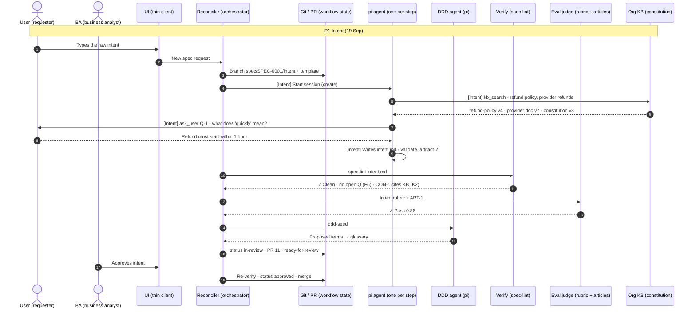
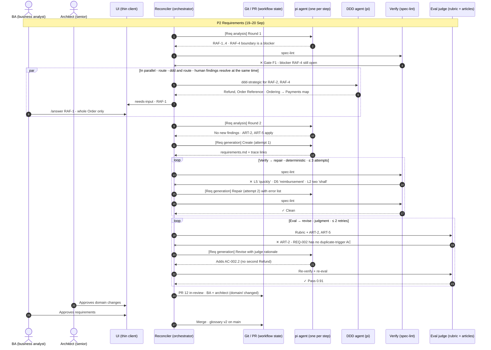
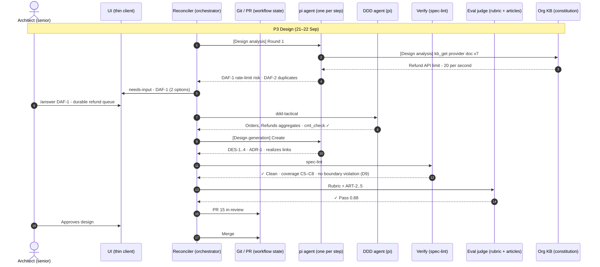
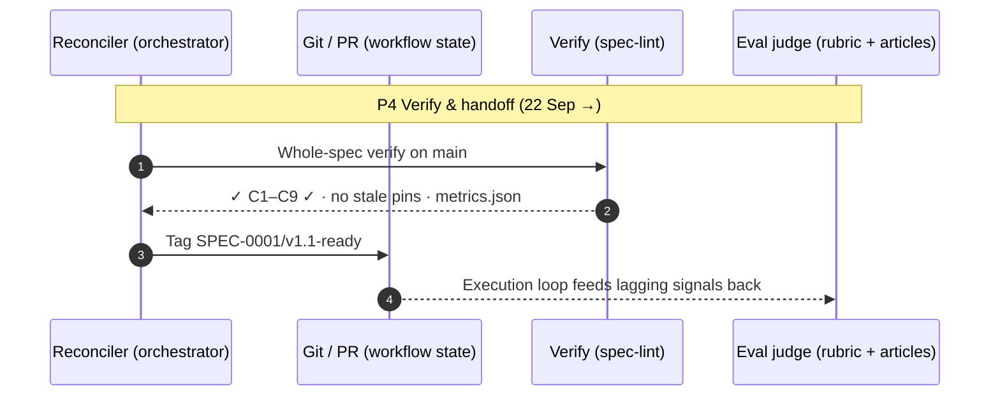

# Scenario: SPEC-0001 end to end

One spec, *automatic refund on pre-shipment cancellation*, from the user's words to a tagged, handoff-ready spec.
Every artifact named here exists in `examples/`. The step numbers match the published walkthrough page, the Excalidraw file and the Mermaid diagrams.

Generated by `docs/scenario/build.py` from `docs/scenario/model.py`. Edit the model, not this file.

## P1 · Intent (19 Sep)

The user's words become intent.md, grounded in the org KB and checked against the constitution.

| # | From → to | What | Gate |
|---|---|---|---|
| 1 | User → UI | Types the raw intent *“Customers who cancel before we ship keep emailing support to get their money back… Support is drowning.”* | human |
| 2 | UI → Reconciler | New spec request |  |
| 3 | Reconciler → Git / PR | Branch spec/SPEC-0001/intent + template *The header pins constitution v3 and the AGENTS.md hash before any agent runs.* |  |
| 4 | Reconciler → pi agent (Intent) | Start session (create) |  |
| 5 | pi agent (Intent) → Org KB | kb_search: refund policy, provider refunds |  |
| 6 | Org KB → pi agent | refund-policy v4 · provider doc v7 · constitution v3 |  |
| 7 | pi agent (Intent) → User | ask_user Q-1: what does “quickly” mean? *Relayed through the reconciler and the UI. The agent never guesses a number.* |  |
| 8 | User → pi agent | Refund must start within 1 hour |  |
| 9 | pi agent (Intent) | Writes intent.md · validate_artifact ✓ *STK-1..3, GOAL-1 (must), GOAL-2 (should), NG-1, CON-1 citing kb:finance-refund-policy@4, SC-1/2, ASM-1, Q-1 answered.* |  |
| 10 | Reconciler → Verify | spec-lint intent.md |  |
| 11 | Verify → Reconciler | Clean · no open Q (F6) · CON-1 cites KB (K2) | ✓ pass |
| 12 | Reconciler → Eval judge | Intent rubric + ART-1 |  |
| 13 | Eval judge → Reconciler | Pass 0.86 | ✓ pass |
| 14 | Reconciler → DDD agent | ddd-seed |  |
| 15 | DDD agent → Reconciler | Proposed terms → glossary |  |
| 16 | Reconciler → Git / PR | status in-review · PR 11 · ready-for-review |  |
| 17 | BA → UI | Approves intent | human |
| 18 | Reconciler → Git / PR | Re-verify · status approved · merge |  |

## P2 · Requirements (19–20 Sep)

Analysis finds gaps, DDD fixes the language and boundaries, and generation is verified, repaired, evaluated and revised.

| # | From → to | What | Gate |
|---|---|---|---|
| 19 | Reconciler → pi agent (Req analysis) | Round 1 |  |
| 20 | pi agent → Reconciler | RAF-1..4 · RAF-4 boundary is a blocker *RAF-1 partial cancellation (human) · RAF-2 “money back” wording (ddd) · RAF-3 provider rejects refund (self) · RAF-4 which context decides (ddd, blocker).* |  |
| 21 | Reconciler → Verify | spec-lint |  |
| 22 | Verify → Reconciler | Gate F1: blocker RAF-4 still open | ✕ fail |
| 23 | Reconciler → DDD agent | ddd-strategic for RAF-2, RAF-4 |  |
| 24 | DDD agent → Reconciler | Refund, Order Reference · Ordering → Payments map *Adds TERM-005 Refund (avoid: reimbursement, money back) and TERM-008 Order Reference. Declares the Ordering and Payments contexts and maps Ordering [OHS,PL] → Payments [ACL].* |  |
| 25 | Reconciler → UI | needs-input: RAF-1 |  |
| 26 | BA → UI | /answer RAF-1: whole Order only | human |
| 27 | Reconciler → pi agent (Req analysis) | Round 2 |  |
| 28 | pi agent → Reconciler | No new findings · ART-2, ART-5 apply |  |
| 29 | Reconciler → pi agent (Req generation) | Create (attempt 1) |  |
| 30 | pi agent → Reconciler | requirements.md + trace links |  |
| 31 | Reconciler → Verify | spec-lint |  |
| 32 | Verify → Reconciler | L5 “quickly” · D5 “reimbursement” · L2 two “shall” *Errors are deterministic, so the same draft always fails the same way. The step is re-run in repair mode with the error list.* | ✕ fail |
| 33 | Reconciler → pi agent (Req generation) | Repair (attempt 2) with error list |  |
| 34 | Reconciler → Verify | spec-lint |  |
| 35 | Verify → Reconciler | Clean | ✓ pass |
| 36 | Reconciler → Eval judge | Rubric + ART-2, ART-5 |  |
| 37 | Eval judge → Reconciler | ART-2: REQ-002 has no duplicate-trigger AC *The draft was lint-clean but broke a constitution article. Only a judgment check could catch this.* | ✕ fail |
| 38 | Reconciler → pi agent (Req generation) | Revise with judge rationale |  |
| 39 | pi agent → Reconciler | Adds AC-002.2 (no second Refund) |  |
| 40 | Reconciler → Eval judge | Re-verify + re-eval |  |
| 41 | Eval judge → Reconciler | Pass 0.91 | ✓ pass |
| 42 | Reconciler → Git / PR | PR 12 in-review · BA + architect (domain/ changed) |  |
| 43 | Architect → UI | Approves domain changes | human |
| 44 | BA → UI | Approves requirements | human |
| 45 | Reconciler → Git / PR | Merge · glossary v2 on main |  |

## P3 · Design (21–22 Sep)

Design analysis raises risks for the architect, DDD adds the tactical model, and generation passes verify and eval first time.

| # | From → to | What | Gate |
|---|---|---|---|
| 46 | Reconciler → pi agent (Design analysis) | Round 1 |  |
| 47 | pi agent (Design analysis) → Org KB | kb_get provider doc v7 |  |
| 48 | Org KB → pi agent | Refund API limit: 20 per second |  |
| 49 | pi agent → Reconciler | DAF-1 rate-limit risk · DAF-2 duplicates *DAF-1 nfr-risk goes to the architect with two options and a recommendation. DAF-2 is a gap the step resolves itself, citing const:ART-2.* |  |
| 50 | Reconciler → UI | needs-input: DAF-1 (2 options) |  |
| 51 | Architect → UI | /answer DAF-1: durable refund queue | human |
| 52 | Reconciler → DDD agent | ddd-tactical |  |
| 53 | DDD agent → Reconciler | Orders, Refunds aggregates · cml_check ✓ *Ordering v2: Order + OrderCancelled. Payments v2: Refund keyed by OrderReference, plus RefundIssued and RefundFailed.* |  |
| 54 | Reconciler → pi agent (Design generation) | Create |  |
| 55 | pi agent → Reconciler | DES-1..4 · ADR-1 · realizes links |  |
| 56 | Reconciler → Verify | spec-lint |  |
| 57 | Verify → Reconciler | Clean · coverage C5–C8 · no boundary violation (D9) *DES-3 in Payments depends on DES-2 in Ordering. That is allowed only because the context map has Ordering → Payments.* | ✓ pass |
| 58 | Reconciler → Eval judge | Rubric + ART-2..5 |  |
| 59 | Eval judge → Reconciler | Pass 0.88 | ✓ pass |
| 60 | Reconciler → Git / PR | PR 15 in-review |  |
| 61 | Architect → UI | Approves design | human |
| 62 | Reconciler → Git / PR | Merge |  |

## P4 · Verify & handoff (22 Sep →)

A whole-spec verify on main, a ready tag, and the feedback path from execution back to eval.

| # | From → to | What | Gate |
|---|---|---|---|
| 63 | Reconciler → Verify | Whole-spec verify on main |  |
| 64 | Verify → Reconciler | C1–C9 ✓ · no stale pins · metrics.json | ✓ pass |
| 65 | Reconciler → Git / PR | Tag SPEC-0001/v1.1-ready |  |
| 66 | Git / PR → Eval judge | Execution loop feeds lagging signals back *plan → code → QA consumes only the tag and adds implements/tests links. Clarification requests, spec-rooted rework and escaped defects are attributed to IDs and flow into the eval sets.* |  |

## Leading metrics at handoff

| Metric | Value | Note |
|---|---|---|
| `goal_coverage` | 1.00 | the must-goal has requirements |
| `ears_rate` | 5 / 5 | every REQ statement is valid EARS |
| `testable_ac_rate` | 7 / 7 | every AC is Given/When/Then |
| `nfr_measurable_rate` | 2 / 2 | every NFR has a number and unit |
| `findings` | 4 RAF · 2 DAF | 1 blocker, 4 major, 1 minor |
| `human_questions` | 3 | Q-1, RAF-1, DAF-1 |
| `repair_attempts` | 1 | req-generation, lint errors |
| `eval_retries` | 1 | req-generation, ART-2 |
| `realization_rate` | 5 / 5 | every must REQ is realized by a DES |
| `boundary_violations` | 0 | D9 |
| `back_edges` | 0 | no requirement changes from design |

## Drawing it yourself

- `docs/scenario/SPEC-0001-scenario.excalidraw`: open it in Excalidraw (File → Open). It is the full swimlane, hand-drawn style, and fully editable.
- `docs/diagrams/*.mmd`: paste any of them into Excalidraw → *More tools* → *Mermaid to Excalidraw*, or render them on GitHub.
